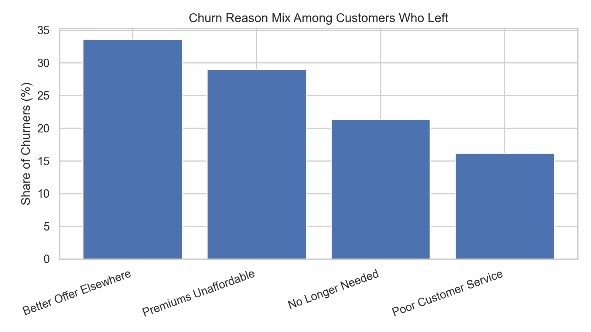
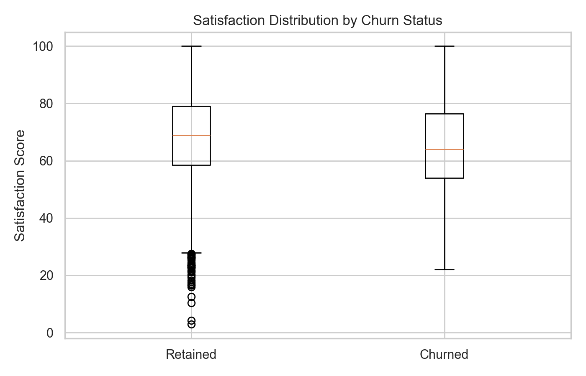
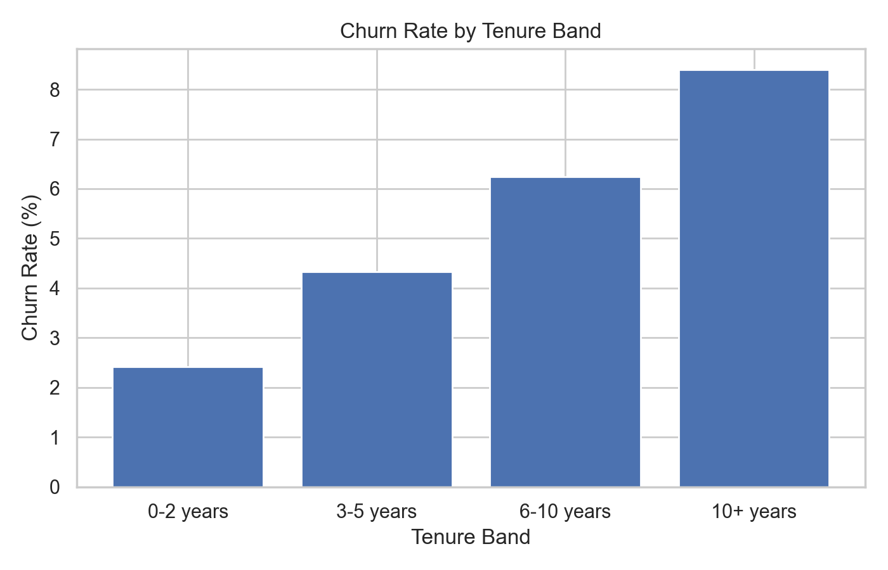
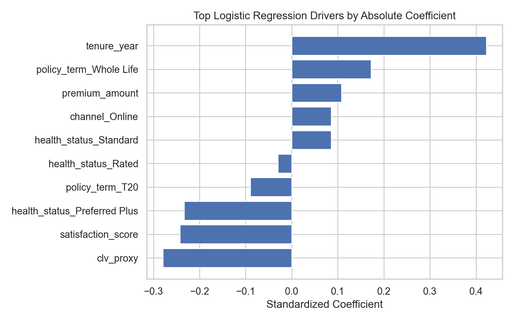
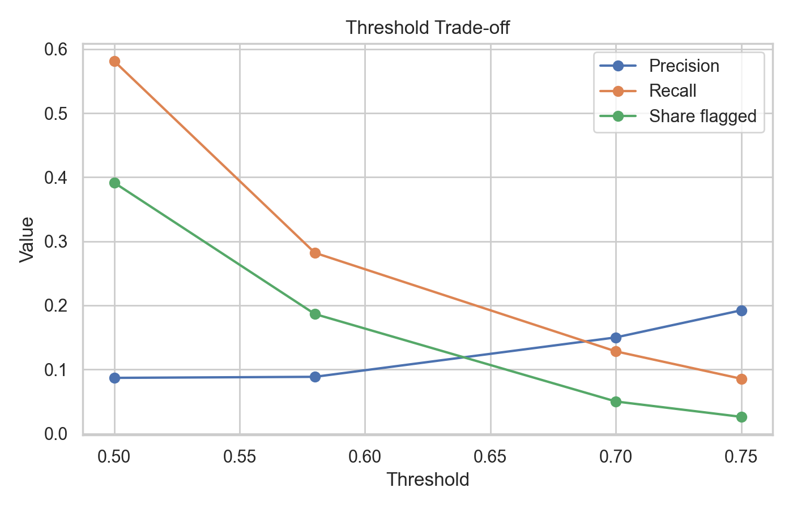
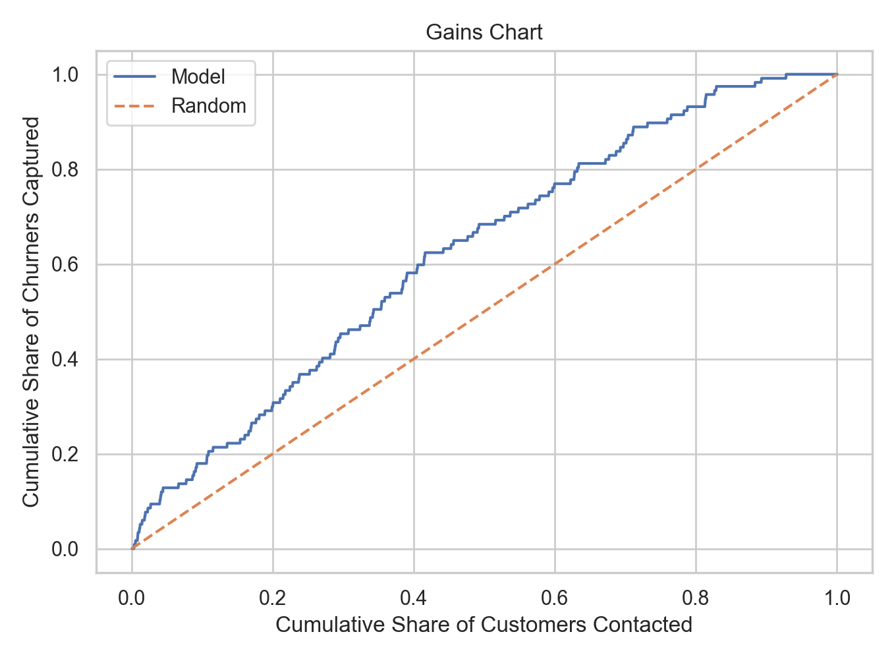

# Insurance Churn Prediction & Early-Warning Retention System


---

## 🏆 Competition Context

This project was developed for the Western University Actuarial Case Competition (WACC 2026), a competitive case event focused on solving real-world insurance business problems using data.

Out of all participating teams, our team placed **Top 4 overall**, presenting a data-driven churn prediction and retention strategy to a panel of judges.

---

## 📌 Overview

This project analyzes customer churn for a life insurance provider (Ontario Life) and develops a **predictive early-warning system** to proactively identify and retain at-risk policyholders.

The goal is not just to predict churn, but to **translate model outputs into actionable business strategy**—enabling targeted retention, optimized outreach, and measurable ROI.

---

## 🎯 Business Objective

Ontario Life operates in a competitive insurance market where:
- Customer acquisition is significantly more expensive than retention
- Churn is difficult to predict due to multiple behavioral and lifecycle factors

This project answers four key questions:

1. Which customers are most at risk of churn?  
2. What factors drive that risk?  
3. How should retention efforts be prioritized?  
4. How can success be measured operationally?  

---

## 📊 Key Results

- **Model**: Balanced Logistic Regression  
- **AUC-ROC**: 0.6329  
- **Accuracy (threshold = 0.58)**: 78.8%  
- **Precision**: 8.8%  
- **Recall**: 28.2%  
- **Churn Rate**: 5.9%  

## 📈 Key Insights & Visual Analysis

### Churn Reason Breakdown


- Churn is driven by a mix of **pricing, competition, lifecycle changes, and service issues**
- No single intervention strategy will address all churn drivers

---

### Satisfaction as an Early Warning Signal


- Lower satisfaction scores strongly correlate with churn  
- Provides a **trigger for proactive intervention before cancellation**

---

### Lifecycle Risk (Tenure)


- Churn increases steadily over time  
- Long-tenured customers are not “safe” and require continued engagement  

---

### Key Drivers from Logistic Regression


- Higher tenure and premiums increase risk  
- Higher satisfaction reduces risk  
- Whole Life policies show elevated churn relative to term products  

---

### Threshold Trade-off


- Lower thresholds increase recall but raise outreach cost  
- Higher thresholds improve precision but reduce coverage  

---

### Model Gains Chart


- Top 30% of customers capture **45.3% of churners**  
- Demonstrates strong targeting efficiency vs random outreach

## 🧠 Approach

### 1. Data Preparation
- Cleaned and structured policyholder-level dataset
- Excluded post-churn variables (e.g., `churn_reason`) to avoid data leakage
- Engineered features such as:
  - Annual premium
  - CLV proxy (premium × tenure)

### 2. Exploratory Data Analysis
Focused on identifying **actionable business patterns**:
- Satisfaction vs churn
- Lifecycle (tenure) effects
- Channel, policy type, and health segmentation
- Churn reason distribution (for strategy, not modeling)

### 3. Modeling
- Trained a **balanced logistic regression model**
- Chosen for:
  - Interpretability
  - Business transparency
  - Direct support for threshold-based decision-making

### 4. Evaluation
- Emphasized **ranking quality (AUC)** over raw accuracy
- Built **threshold trade-off analysis**
- Developed **gains chart** for targeting efficiency

---

## ⚙️ From Model → Business Strategy

The model is designed as a **ranking engine**, not a binary classifier.

### 🎯 Threshold-Based Triage

| Tier | Risk Threshold | Strategy |
|------|--------------|---------|
| **Tier 1** | ≥ 0.75 | High-touch intervention (calls, premium review) |
| **Tier 2** | 0.70–0.75 | Personalized digital outreach + escalation |
| **Tier 3** | 0.58–0.70 | Low-cost nudges + monitoring |

## 🚀 Deployment & Operationalization

To move from analysis to real-world impact, this model should be deployed as a **monthly churn monitoring system** integrated into Ontario Life’s operations.

### 🧩 System Design

1. **Monthly Data Pipeline**
   - Pull latest customer, policy, and satisfaction data
   - Recompute engineered features (e.g., premium, tenure, CLV proxy)

2. **Model Scoring**
   - Apply the trained logistic regression model
   - Generate a **churn risk score (0–1)** for every active policyholder

3. **Customer Ranking**
   - Sort customers by predicted churn probability
   - Assign customers into Tier 1, Tier 2, and Tier 3 based on thresholds

4. **Actionable Output**
   - Export a **ranked outreach list** to retention teams
   - Include key attributes (risk score, premium, tenure, satisfaction)

---

### ⚙️ Integration with Business Teams

- **Retention Team**
  - Receives Tier 1 and Tier 2 lists for direct outreach
- **Marketing Team**
  - Executes automated campaigns for Tier 3 customers
- **Customer Experience Team**
  - Monitors satisfaction-triggered alerts for early intervention

---

### 🔄 Continuous Monitoring

To ensure long-term performance:

- Track **model drift** and recalibrate regularly  
- Re-evaluate thresholds based on:
  - Outreach capacity  
  - Save rates  
  - Cost constraints  
- Retrain the model periodically with updated data  

---

### 📊 Feedback Loop

The system should evolve based on real outcomes:

- Capture:
  - Whether customers were contacted  
  - Whether they were retained  
- Use this data to:
  - Improve model performance  
  - Optimize intervention strategies  
  - Quantify true ROI  

---

### 💡 Why this matters

This deployment design turns the model into a **scalable decision-making system**, enabling:

- Proactive retention instead of reactive churn response  
- Efficient allocation of outreach resources  
- Continuous improvement through data feedback  

The result is not just a predictive model, but a **fully operational early-warning retention system**.
---

## 📈 Business Impact

### What the Model Enables
- Prioritized outreach instead of blanket campaigns  
- Concentration of churners into smaller, actionable segments  
- Data-driven retention strategy design  

### Example Efficiency Gains
- Top 10% of customers → captures **17.9%** of churners  
- Top 20% → **29.9%**  
- Top 30% → **45.3%**  

---

## 🧪 Implementation Framework

This project proposes a **pilot-based rollout strategy**:

### Phase 1: Pilot
- Target Tier 1 & Tier 2 customers  
- Measure baseline save rates  

### Phase 2: Expansion
- Introduce Tier 3 digital outreach  
- A/B test messaging and offers  

### Phase 3: Scale
- Automate monthly scoring  
- Monitor model performance and drift  

---

## 📊 Measuring Success

The dataset demonstrates **targeting value**, but not full ROI.

Ontario Life should track:

- Save rate (by tier)  
- Cost per outreach & cost per save  
- Retained premium  
- Incremental lift vs control group  

---

## 📁 Repository Structure
```
/
├── README.md
├── requirements.txt
├── data/
│   └── Insurance Churn Dataset.xlsx
├── notebooks/
│   └── ontario_life_churn_report.ipynb
├── src/
│   └── churn_utils.py
├── reports/
│   └── figures/
│       ├── churn_reasons.png
│       ├── gains_chart.png
│       ├── logistic_drivers.png
│       ├── satisfaction_gap.png
│       ├── tenure_band_churn.png
│       └── threshold_tradeoff.png
└── references/
    ├── Insurance Churn Case.pdf
    └── Reducing_Churn_at_Ontario_Life_Early_Warning_Retention_System.pptx
```
--- 

## 🚀 How to Run

1. Create a virtual environment.
2. Install dependencies with:
   pip install -r requirements.txt
3. Launch Jupyter:
   jupyter notebook
4. Open notebooks/01_ontario_life_churn_report.ipynb
5. Run all cells from top to bottom.

---

## 🧩 Key Takeaways

- Churn prediction alone is not enough—**operationalization is critical**
- Logistic regression provides strong **interpretability and ranking power**
- **Threshold design converts analytics into business strategy**
- The next step is a **controlled pilot with measurable ROI**

---

## 📌 Final Note

This project is structured as a **consulting-style deliverable**, emphasizing:
- Clear business interpretation  
- Actionable insights  
- Practical implementation strategy  

It demonstrates how data science can drive **real-world decision-making and measurable impact**.
